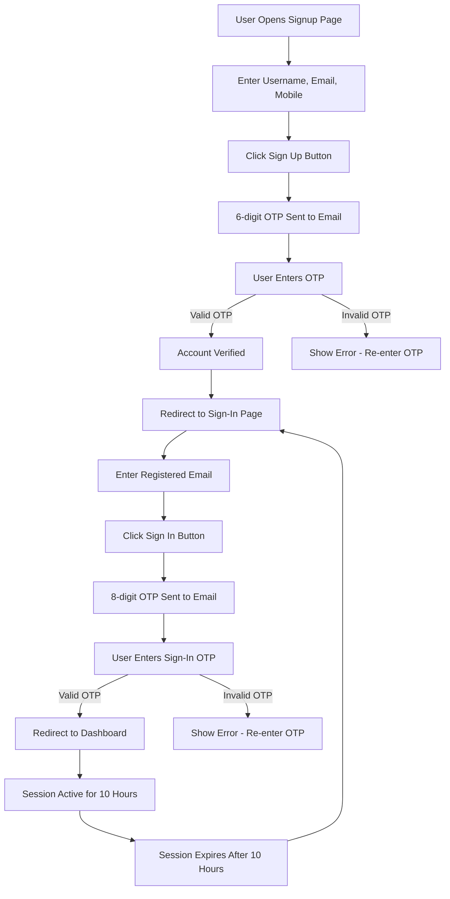

# Onboarding

## QuantixOne User Onboarding Guide

This page explains the complete onboarding process for QuantixOne, including sign-up and sign-in procedures with OTP-based authentication.

---

## Sign Up

### QuantixOne Sign-Up Page

The QuantixOne Sign-Up Page enables new users to register quickly and securely. It's designed with a clean, two-column layout — a user form on the left and real customer testimonials on the right — ensuring both usability and brand trust.

  
  
<em>Figure 1: QuantixOne Sign Up Interface</em>

---

## Sign-Up Process

To create a new account on QuantixOne, follow the steps below:

### Step 1: Access the Sign-Up Page

Go to the Sign-Up Page.

### Step 2: Enter Your Details

Enter the following details:

- **Username**: e.g., xyz (no spaces allowed)
- **Email ID**: xyz@grooveinnovations.ai
- **Mobile Number**: +91 xxxxxxxxxx

### Step 3: Submit Your Registration

Click on **Sign Up**.

### Step 4: Verify Your Email

You will receive a **6-digit OTP** on your Outlook email.

### Step 5: Enter OTP

Enter this OTP in the verification field on the sign-up page.

### Step 6: Complete Registration

After successful verification, you will be redirected to the Sign-In page.
## Signup Validation (Video Demo)

The following video demonstrates the complete signup validation process from start to finish:

<video 
  controls 
  width="800"
  controlsList="nodownload noremoteplayback"
  oncontextmenu="return false;"
  disablePictureInPicture
>
  <source src="https://media-docs.quantixone.com/videos/cognito-signup-validator.webm" type="video/webm">
  Your browser does not support the video tag.
</video>

---

## Form Fields

The registration form collects essential details for user verification and personalization. All mandatory fields are marked with an asterisk (*).

### Required Fields

Fields include:

- **First Name & Last Name**
- **Date of Birth** (YYYY-MM-DD)
- **Email** (validated format)
- **Mobile Number** (+91 with 10 digits)
- **Country, State, City**, and **6-digit Pincode**

### Create Account Button

- Becomes active only when all fields are correctly filled.
- Triggers validation and backend submission.

!!! note "Important Name Requirements"
    **First Name and Last Name:**
    
    - Must be at least 3 characters or more.
    - No spaces are allowed in either field.

---

## Sign-In Process

### QuantixOne Sign-In Page

The Sign-In Page enables verified users to access their QuantixOne account using secure, OTP-based authentication. It offers a passwordless login mechanism, enhancing security and simplifying access.

  
  
<em>Figure 2: QuantixOne Sign In Interface</em>

---

## Form Fields

### Authentication Tabs

- **Sign In (Active)** – For returning users.
- **Sign Up** – Redirects to registration form for new users.

### Input Field

- **Email Address**: Enter the same email used during registration (e.g., xyz@grooveinnovations.ai).

### Button: Send Verification Code

Sends a new OTP to the registered email.

---

## Step-by-Step Sign-In Guide

Once your account is verified, follow these steps to log in:

### Step 1: Enter Your Email

On the Sign-In page, enter your registered email ID – xyz@grooveinnovations.ai

### Step 2: Click Sign In

Click on **Sign In**.

### Step 3: Receive OTP

A new **8-digit OTP** will be sent to your registered email.

### Step 4: Enter OTP

Enter this OTP in the sign-in verification field.

### Step 5: Access Dashboard

After successful verification, you'll be redirected to the QuantixOne Dashboard.

---

---

## Onboarding Workflow

---

## Re-login and Session Details

### Session Management

- You can re-login anytime using your registered email ID via the Sign-In page.
- Your login session will remain active for **10 hours** in the same browser tab.
- After 10 hours, you will need to log in again using a new OTP.

!!! warning "Session Limitation"
    Avoid logging in from multiple tabs or browsers simultaneously.

---

## Important Note

### Name Requirements

**First Name and Last Name:**

- Must be at least 3 characters or more.
- No spaces are allowed in either field.

### OTP Types

- **OTP for Sign-Up (Verification)**: You will receive a **6-digit OTP** on your registered Outlook email.
- **OTP for Sign-In (Authentication)**: You will receive an **8-digit OTP** on your registered email each time you log in.

### Security Guidelines

- Do not request multiple OTPs in quick succession — the system has a limited OTP quota for users.
- Avoid logging in from multiple tabs or browsers simultaneously.

---

## Validation Rules

The system performs multiple validation checks:

| Field | Validation Rule | Example |
|-------|----------------|---------|
| Username | No spaces allowed | xyz |
| Email | Must be valid email format | xyz@grooveinnovations.ai |
| Mobile | +91 with 10 digits | +91 9876543210 |
| First Name | At least 3 characters, no spaces | John |
| Last Name | At least 3 characters, no spaces | Doe |
| Date of Birth | YYYY-MM-DD format | 1990-01-15 |
| Pincode | 6 digits | 560001 |

---

## Security Features

### Passwordless Authentication

QuantixOne uses passwordless, OTP-based authentication over encrypted HTTPS connections, ensuring your login is fully secure.

### Benefits

- No password to remember or forget
- Reduced risk of password-related breaches
- Simple and quick authentication process
- Enhanced security through time-limited OTPs

### Two Types of OTPs

| Purpose | OTP Type | Delivery Method |
|---------|----------|-----------------|
| Sign-Up Verification | 6-digit OTP | Verified Outlook email |
| Sign-In Authentication | 8-digit OTP | Registered Outlook email |

---

## Troubleshooting

### Common Issues

**Issue: I didn't receive my OTP**

If you don't receive your OTP:

- Check your Outlook inbox, Spam, and Junk folders.
- Wait a few minutes before retrying.
- Avoid sending too many OTP requests — there's a limited quota.

**Issue: My OTP is invalid or expired**

If your OTP is rejected:

- Request a new OTP and enter it carefully.
- Only the latest OTP sent to your email will be valid.

**Issue: Can I log in from multiple tabs or browsers?**

No. For security and stability, QuantixOne allows only one active session per user. Stay logged in within the same tab or browser.

---

## Frequently Asked Questions

**Q: How do I sign up on QuantixOne?**  
A: Go to the Sign-Up page, fill in all required details, and click **Create Account**. A 6-digit OTP will be sent to your registered Outlook email. Enter the OTP to verify and complete your registration.

**Q: What are the rules for entering my name?**  
A: First Name and Last Name must each have at least 3 characters. Spaces are not allowed in either field.

**Q: What kind of OTP will I receive during sign-up?**  
A: During sign-up, you'll receive a **6-digit OTP** on your registered email. This OTP is required to verify your email and activate your account.

**Q: How do I sign in after creating my account?**  
A: On the Sign-In page, enter your registered email address and click **Send Verification Code**. An **8-digit OTP** will be sent to your email. Enter this OTP to log in.

**Q: Why are there two types of OTPs (6-digit and 8-digit)?**  
A: 
- **6-digit OTP** → for sign-up verification (account creation)
- **8-digit OTP** → for sign-in authentication (login access)

**Q: I didn't receive my OTP. What should I do?**  
A: 
- Check your Outlook inbox, Spam, and Junk folders.
- Wait a few minutes before retrying.
- Avoid sending too many OTP requests — there's a limited quota.

**Q: How long will my login session remain active?**  
A: Once signed in, your session stays active for **10 hours** in the same browser tab. After that, you'll need to sign in again with a new OTP. Do not attempt multiple login's.

**Q: Can I log in from multiple tabs or browsers?**  
A: No. For security and stability, QuantixOne allows only one active session per user. Stay logged in within the same tab or browser.

**Q: What should I do if my OTP is invalid or expired?**  
A: Request a new OTP and enter it carefully. Only the latest OTP sent to your email will be valid.

**Q: Is the authentication process secure?**  
A: Yes. QuantixOne uses passwordless, OTP-based authentication over encrypted HTTPS connections, ensuring your login is fully secure.

---