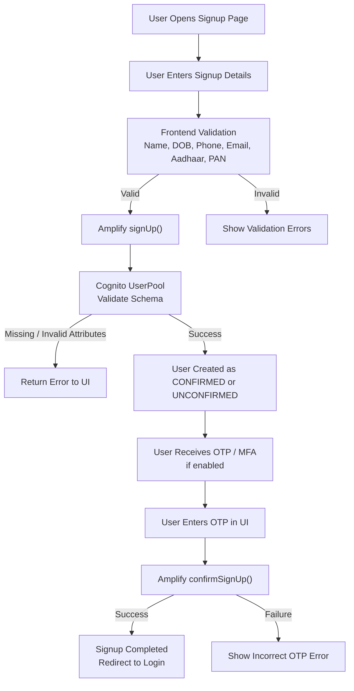

# Cognito

## Cognito Signup Validation

This page explains the Cognito signup validation flow integrated into the QuantixOne application.

---

## Signup Validation Workflow (Mermaid)



---

## User Authentication Flow

### Sign In Process

The sign-in process begins when users access the authentication page. Below is the sign-in interface:

<div align="center">
  
  <p><em>Figure 1: QuantixOne Sign In Interface</em></p>
</div>

Users can authenticate using their registered email and password. If they don't have an account, they can navigate to the signup page.

---

### Sign Up Process

For new users, the registration process collects essential information required for account creation:

<div align="center">
  
  <p><em>Figure 2: QuantixOne Sign Up Form</em></p>
</div>

The signup form includes the following fields:

- **Personal Information**: First Name, Last Name, Date of Birth
- **Contact Details**: Email Address, Mobile Number
- **Location**: Country, State, City, Pincode
- **Identity Verification**: Aadhaar Number, PAN Number

!!! note "Important"
    All fields marked with asterisk (*) are mandatory. Ensure you provide valid information to avoid validation errors.

---

## Signup Validation (Video Demo)

The following video demonstrates the complete signup validation process from start to finish:

<video 
  controls 
  width="800"
  controlsList="nodownload noremoteplayback"
  oncontextmenu="return false;"
  disablePictureInPicture
>
  <source src="https://dbmgw9llaznft.cloudfront.net/videos/cognito-signup-validator.webm" type="video/webm">
  Your browser does not support the video tag.
</video>

---

## Step-by-Step Registration Guide

### Step 1: Access the Signup Page

Navigate to the QuantixOne signup page. You will see the registration form as shown in the image above.

### Step 2: Fill Personal Details

Enter your first name, last name, and date of birth. Make sure the date of birth indicates you are 18 years or older.

### Step 3: Provide Contact Information

Enter a valid email address and mobile number. These will be used for:

- Account verification
- Password recovery
- Important notifications
- OTP delivery

### Step 4: Enter Location Details

Select your country, state, and enter your city and pincode. This information helps us provide region-specific services.

### Step 5: Identity Verification

Provide your Aadhaar number (12 digits) and PAN number. These are required for compliance with Indian regulations.

!!! warning "Privacy Notice"
    Your Aadhaar and PAN details are encrypted and stored securely in compliance with data protection laws.

### Step 6: Submit and Verify

After submitting the form, you'll receive an OTP on your registered mobile number and email. Enter the OTP to complete the verification process.

---

## Validation Rules

The system performs multiple validation checks:

| Field | Validation Rule | Example |
|-------|----------------|---------|
| Email | Must be valid email format | user@example.com |
| Mobile | 10 digits, Indian format | 9876543210 |
| Aadhaar | Exactly 12 digits | 123456789012 |
| PAN | 10 characters (AAAAA9999A) | ABCDE1234F |
| Date of Birth | User must be 18+ years | 01/01/2000 |
| Pincode | 6 digits | 560001 |

---

## Error Handling

If any validation fails, you'll see specific error messages:

- ❌ **Invalid Email**: "Please enter a valid email address"
- ❌ **Invalid Mobile**: "Mobile number must be 10 digits"
- ❌ **Invalid Aadhaar**: "Aadhaar number must be exactly 12 digits"
- ❌ **Invalid PAN**: "PAN must follow format: AAAAA9999A"
- ❌ **Age Restriction**: "You must be 18 years or older"

---

## Security Features

### Password Requirements

When creating your password, ensure it meets these criteria:

- Minimum 8 characters
- At least one uppercase letter (A-Z)
- At least one lowercase letter (a-z)
- At least one number (0-9)
- At least one special character (!@#$%^&*)

### Multi-Factor Authentication (MFA)

For enhanced security, we recommend enabling MFA:

1. SMS-based OTP
2. Email-based verification
3. Authenticator app (optional)

---

## Troubleshooting

### Common Issues

**Issue 1: "Email already exists"**

If you see this error, it means an account with this email already exists. Try:

- Using the "Forgot Password" option on the sign-in page
- Contact support if you don't remember registering

**Issue 2: "Invalid OTP"**

If your OTP is rejected:

- Check if you entered the correct OTP
- OTP expires in 5 minutes - request a new one if needed
- Ensure you're checking the correct email/SMS

**Issue 3: "Invalid Aadhaar/PAN format"**

- Aadhaar must be exactly 12 numeric digits
- PAN must follow the format: 5 letters + 4 numbers + 1 letter (e.g., ABCDE1234F)

---

## AWS Cognito Integration

### Backend Configuration

Our authentication system uses AWS Cognito User Pools with the following configuration:

```javascript
// Amplify Configuration
const amplifyConfig = {
  Auth: {
    region: 'ap-south-1',
    userPoolId: 'ap-south-1_XXXXXXXXX',
    userPoolWebClientId: 'XXXXXXXXXXXXXXXXXXXXXXXXXX',
    mandatorySignIn: true,
    authenticationFlowType: 'USER_SRP_AUTH'
  }
};
```

### Custom Attributes

We've configured the following custom attributes in Cognito:

- `custom:aadhaar_number` (String, mutable)
- `custom:pan_number` (String, mutable)
- `custom:city` (String, mutable)
- `custom:pincode` (String, mutable)

---

## API Endpoints

The signup process interacts with these endpoints:

| Endpoint | Method | Purpose |
|----------|--------|---------|
| `/auth/signup` | POST | Create new user account |
| `/auth/confirm` | POST | Verify OTP and activate account |
| `/auth/resend` | POST | Resend verification OTP |
| `/auth/signin` | POST | User authentication |

---

## New Page Updated

The following text is autodeployed from github actions.

---

## Additional Resources

For more information about authentication and security:

- [AWS Cognito User Pools Documentation](https://docs.aws.amazon.com/cognito/latest/developerguide/cognito-user-identity-pools.html)
- [AWS Amplify Authentication Guide](https://docs.amplify.aws/lib/auth/getting-started/q/platform/js/)
- [QuantixOne Security Policy](https://docs.quantixone.com/security)

!!! tip "Need Help?"
    If you encounter any issues during signup or have questions about the process, please contact our support team at support@quantixone.com

---

## Frequently Asked Questions

**Q: Is my data secure?**  
A: Yes, all sensitive data is encrypted at rest and in transit using industry-standard encryption protocols.

**Q: Can I change my Aadhaar/PAN details later?**  
A: Yes, you can update these details from your profile settings after verification by our compliance team.

**Q: What happens if I forget my password?**  
A: Use the "Forgot Password" link on the sign-in page. You'll receive a password reset link via email.

**Q: How long does verification take?**  
A: OTP verification is instant. Account activation happens immediately after successful OTP verification.

---

