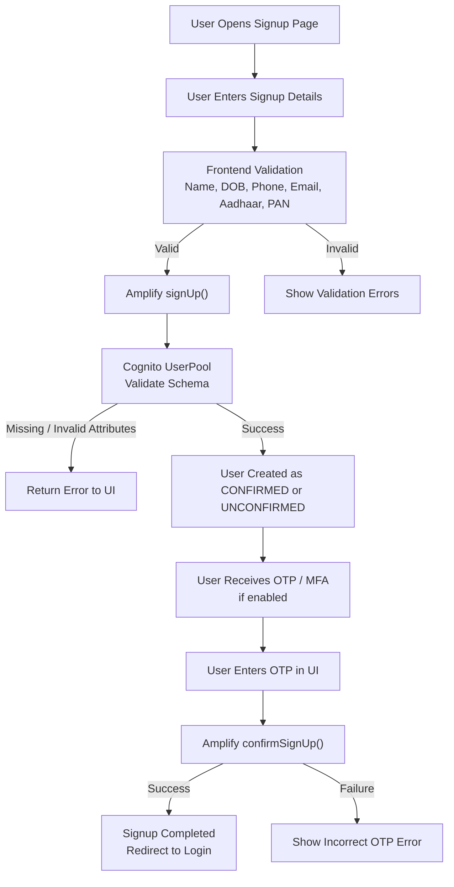

# Cognito

## Cognito Signup Validation

This page explains the Cognito signup validation flow integrated into the QuantixOne application.

---

## Signup Validation Workflow (Mermaid)

---

## Signup Validation (Video)

The following video demonstrates the complete signup validation process:

<video controls width="800">
  <source src="https://dbmgw9llaznft.cloudfront.net/cognito-signup-validator.webm" type="video/webm">
  Your browser does not support the video tag.
</video>

## new page updated

The following text is autodeployed from github actions
